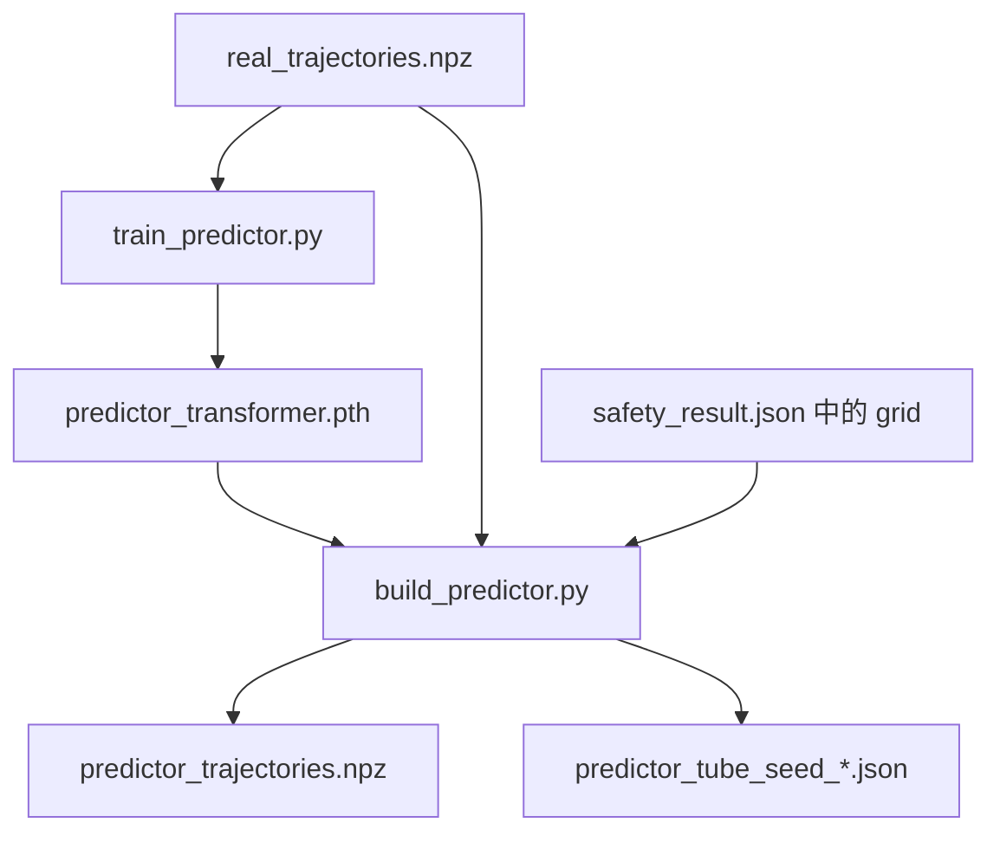

# Trajectory Predictor

该模块使用 Transformer 学习从初始状态到完整未来轨迹的映射，并在验证网格的每个 cell 内采样初始状态，用多条预测轨迹的逐时刻最小值和最大值构造 raw Predictor tube。

当前版本支持以下环境：

| 环境 | 状态维度 | 预测步数 `HORIZON` | 轨迹中的状态数 |
| --- | ---: | ---: | ---: |
| `pendulum` | 2 | 20 | 21 |
| `mountain_car` | 2 | 20 | 21 |
| `cartpole` | 4 | 20 | 21 |
| `brake_system` | 2 | 10 | 11 |

> `HORIZON` 表示 transition 数量，所以每条轨迹包含 `HORIZON + 1` 个状态：初始状态 `s0` 和未来状态 `s1 ... sH`。Predictor 不单独设置时间步长 `dt`，每一步的物理时间由生成 `real_trajectories.npz` 的原始动力学决定。

## 1. 文件结构

```text
trajectory_predictor/
├── config.py
├── predictor_model.py
├── train_predictor.py
├── build_predictor.py
├── README.md
└── models/
    └── <environment>/
        ├── predictor_transformer.pth
        ├── predictor_trajectories.npz
        ├── predictor_tube_seed_0.json
        ├── predictor_tube_seed_1.json
        ├── predictor_tube_seed_2.json
        ├── predictor_tube_seed_3.json
        └── predictor_tube_seed_4.json
```

各程序的作用如下：

| 文件 | 作用 |
| --- | --- |
| `config.py` | 选择环境，设置输入输出路径、训练参数、采样策略和 build seeds |
| `predictor_model.py` | 定义 Transformer、损失函数、checkpoint 加载和批量推理 |
| `train_predictor.py` | 从真实轨迹训练模型并保存 `predictor_transformer.pth` |
| `build_predictor.py` | 生成格式兼容的预测轨迹，以及多个 raw Predictor tube |

当前构建流程不会生成 `conformal_real_trajectories.npz`，也不会对 raw tube 做 conformal inflation。

## 2. 整体流程



流程分为两个阶段：

1. 训练：用真实轨迹训练 `initial state -> complete trajectory` 模型。
2. 构建：加载 checkpoint，对真实数据中的初始状态生成预测轨迹，并对每个 grid cell 构造 raw tube。

## 3. 环境与依赖

建议使用项目现有的 StarV/PyTorch 虚拟环境。最低运行依赖为：

```text
Python 3.9+
NumPy
PyTorch
```

进入目录：

```bash
cd /home/UFAD/xinyangwang/projects/verifiable_wm/trajectory_predictor
```

## 4. 配置

所有配置都集中在 `config.py`，两个主程序不需要命令行参数。

### 4.1 选择环境

只保留一个未注释的环境，例如：

```python
ENVIRONMENT = "pendulum"
```

支持：

```python
"pendulum"
"mountain_car"
"cartpole"
"brake_system"
```

`HORIZON` 会根据环境自动设置：

```python
ENVIRONMENT_HORIZONS = {
    "pendulum": 20,
    "mountain_car": 20,
    "cartpole": 20,
    "brake_system": 10,
}
```

### 4.2 输入路径

确认以下路径与所选环境对应：

```python
REAL_TRAJECTORIES = Path(".../real_trajectories.npz")
GRID_RESULT = GRID_RESULTS[ENVIRONMENT]
CHECKPOINT = Path(".../predictor_transformer.pth")
```

- `REAL_TRAJECTORIES`：训练数据，同时也是预测轨迹输出的格式模板。
- `GRID_RESULT`：必须是包含 `grid.dims` 的安全分析 JSON。
- `CHECKPOINT`：训练阶段的输出，也是构建阶段的输入。

不要只修改 `ENVIRONMENT` 而忘记检查 `REAL_TRAJECTORIES`。当前文件中该路径可以是手动指定的绝对路径。

### 4.3 每个 cell 的采样设置

当前默认值：

```python
SAMPLES_PER_CELL = 3
CELL_SAMPLING_STRATEGY = "latin_hypercube"
BUILD_SEEDS = (0, 1, 2, 3, 4)
```

采样策略：

| 策略 | 说明 | seed 是否改变结果 |
| --- | --- | --- |
| `latin_hypercube` | 每个维度分层后随机采样，3 个点分布较均匀，推荐用于多个 tube | 是 |
| `random_uniform` | 在 cell 内独立均匀随机采样 | 是 |
| `diagonal` | 在 lower-to-upper 对角线上等距取点；3 点时为 lower、center、upper | 否 |

如果只需要一个 tube：

```python
BUILD_SEEDS = (0,)
```

此时输出文件名为 `predictor_tube.json`。多个 seed 时，输出文件名自动变为 `predictor_tube_seed_<seed>.json`。

## 5. 训练 Predictor

运行：

```bash
python train_predictor.py
```

### 5.1 训练数据划分

当输入中存在 `train_traj` 时：

```text
train_traj
├── fit subset：更新模型参数
└── selection subset：选择最佳 epoch 和 early stopping

val_traj：不参与参数更新
test_traj：不参与训练或模型选择
```

当数据集缺少 `train_traj`，例如当前 Brake System 数据时：

```python
MISSING_TRAIN_POLICY = "split_val"
DERIVED_TRAIN_RATIO = 0.8
```

程序会使用固定 seed 将原始 `val_traj` 确定性地拆分为：

```text
原始 val_traj
├── 80% derived training subset
└── 20% held-out subset
```

derived training subset 随后再按 `TRAIN_FIT_RATIO` 拆成 fit 和 selection。拆分索引和原始数组 fingerprint 会写入 checkpoint，方便复现与数据一致性检查。

当前 raw-only 构建仍会对原始 NPZ 中完整的 `val_traj` 生成预测，不会另外输出 calibration NPZ。

### 5.2 Pendulum 角度处理

Pendulum 的角度会在训练前沿时间轴执行 unwrap，避免轨迹经过 `pi/-pi` 边界时出现数值跳变。checkpoint 会记录：

```text
angle_representation = "unwrapped_theta"
```

构建输出时，预测角度重新 wrap 到周期范围。`REQUIRE_UNWRAPPED_PENDULUM_CHECKPOINT = True` 用于拒绝不兼容的旧 checkpoint。

### 5.3 模型输入与输出

模型不是递归地一步步预测，而是一次输出完整轨迹：

$$
s_0 \longrightarrow [\hat{s}_0,\hat{s}_1,\ldots,\hat{s}_H]
$$

输入形状：

```text
(batch_size, state_dim)
```

输出形状：

```text
(batch_size, HORIZON + 1, state_dim)
```

模型强制令预测的第 0 个状态等于输入初始状态：

$$
\hat{s}_0=s_0
$$

训练损失为完整轨迹 MSE 加终点状态额外惩罚：

```math
\mathcal{L}
=
\mathrm{MSE}\left(\hat{s}_{0:H}, s_{0:H}\right)
+
\lambda_{\mathrm{terminal}}
\mathrm{MSE}\left(\hat{s}_{H}, s_{H}\right)
```

训练完成后生成：

```text
models/<environment>/predictor_transformer.pth
```

checkpoint 包含模型权重、模型结构、状态均值与标准差、环境、horizon、最佳 epoch、最佳 selection loss 和数据划分信息。

## 6. 构建预测轨迹和 raw tube

训练成功后运行：

```bash
python build_predictor.py
```

程序首先检查：

- 真实轨迹、grid JSON 和 checkpoint 是否存在；
- config 环境是否与 checkpoint 环境一致；
- checkpoint horizon 是否与 config 一致；
- grid 状态维度是否与模型状态维度一致；
- Pendulum checkpoint 是否采用 unwrapped theta；
- 输出扩展名、采样策略和 seeds 是否有效。

### 6.1 生成 `predictor_trajectories.npz`

程序读取 `real_trajectories.npz` 中存在的轨迹 split：

```text
train_traj（如果存在）
val_traj
test_traj
```

对每个 split，只使用真实初始状态进行模型推理：

```python
initial_states = trajectories[:, 0, :]
```

随后用预测轨迹替换对应的 `*_traj`，并保留源文件中的 action 和其他元数据。

兼容性规则：

- `*_traj` 的键、shape 和 dtype 与真实文件一致；
- 第 0 个状态与真实轨迹逐元素完全相同；
- `*_actions` 从真实文件原样复制；
- `rollout_steps`、`starv_config`、`controller_weights` 等已有元数据原样保留；
- 额外写入 Predictor 的 checkpoint、环境和格式说明。

注意：actions 仅用于保持数据格式和下游程序兼容。当前模型只输入初始状态，不直接使用 action 序列。

### 6.2 构造每个 cell 的 tube

对于第 `c` 个 cell，程序采样 3 个初始状态：

$$
x^{(1)}_{c,0},\;x^{(2)}_{c,0},\;x^{(3)}_{c,0}
$$

分别预测完整轨迹：

$$
\hat{x}^{(i)}_{c,0:H}=f_\theta(x^{(i)}_{c,0})
$$

然后在每个时间点和每个状态维度上取最小值与最大值：

$$
l_{c,t,d}=\min_i \hat{x}^{(i)}_{c,t,d},
\qquad
u_{c,t,d}=\max_i \hat{x}^{(i)}_{c,t,d}
$$

得到区间：

$$
T_{c,t,d}=[l_{c,t,d},u_{c,t,d}]
$$

内部 tube 数组形状为：

```text
(number_of_cells, HORIZON + 1, state_dim, 2)
```

最后一维中的 `0` 是 lower，`1` 是 upper。

时间 `t=0` 使用整个 cell 的原始边界，而不是仅使用 3 个采样点的 min/max。这样可以保证该 cell 中任意初始状态都属于 tube 的初始集合。从 `t=1` 开始使用模型预测的 min/max。

cell 内的 3 条临时预测轨迹只存在于内存中，不会被另外保存。

## 7. 输出文件

默认的 5 个 seeds 会生成：

```text
models/<environment>/predictor_trajectories.npz
models/<environment>/predictor_tube_seed_0.json
models/<environment>/predictor_tube_seed_1.json
models/<environment>/predictor_tube_seed_2.json
models/<environment>/predictor_tube_seed_3.json
models/<environment>/predictor_tube_seed_4.json
```

### 7.1 `predictor_trajectories.npz`

示例：

```text
train_traj      (N_train, H + 1, state_dim)   # 源文件存在时保留
train_actions   (N_train, H, action_dim)
val_traj        (N_val, H + 1, state_dim)
val_actions     (N_val, H, action_dim)
test_traj       (N_test, H + 1, state_dim)
test_actions    (N_test, H, action_dim)
```

Brake System 的源文件没有 `train_traj/train_actions`，因此对应的 Predictor NPZ 也不会人为添加这两个键。这种行为是“与源文件格式一致”，而不是要求四个环境拥有完全相同的键集合。

额外元数据包括：

```text
decoder_weights
environment
trajectory_format = "real_trajectories_compatible_v3"
predictor_checkpoint
reference_real_trajectories
action_source = "copied_from_reference_real_trajectories"
```

### 7.2 `predictor_tube_seed_<seed>.json`

顶层主要字段：

```text
method
environment
guarantee_type
sampling_strategy
build_seed
run_index
total_runs
samples_per_cell
horizon
state_dim
grid
cells
```

每个 cell 的格式：

```json
{
  "bounds": [
    [["dim0 lower", "dim0 upper"], ["dim1 lower", "dim1 upper"]],
    [["dim0 lower", "dim0 upper"], ["dim1 lower", "dim1 upper"]]
  ]
}
```

`bounds` 长度为 `HORIZON + 1`。

Pendulum 的角度区间跨越周期边界时，一个维度可能包含两对 lower/upper 数值，用于表示两个区间的并集。下游程序应按区间对解析，而不能假设每个维度永远只有两个数字。

## 8. 自动验证与安全写入

正式覆盖输出前，程序先写入临时文件：

```text
predictor_trajectories.building.npz
predictor_tube_seed_<seed>.building.json
```

随后验证：

- 预测 NPZ 与真实 NPZ 的轨迹 shape、dtype 和初始状态；
- action 是否完全复制；
- 可选元数据是否保留；
- tube 的 cell 数量、horizon、状态维度和区间格式；
- 真实轨迹的初始状态能否映射到正确 grid cell。

所有 seed 的输出都通过验证后，程序才使用原子替换写入正式文件。发生异常时会清理临时文件。

## 9. 重要限制

raw Predictor tube 只包络每个 cell 中采样的 3 条模型预测轨迹。因此：

```text
guarantee_type = "sampled envelope; no formal coverage guarantee"
```

它不能形式化保证覆盖：

- cell 内所有可能的初始状态；
- 真实系统的所有未来轨迹；
- Predictor 自身的模型误差。

不同 seed 用于观察 tube 对采样点的敏感性，不能替代可达性证明或 conformal coverage guarantee。

另外，`predictor_trajectories.npz` 和 tube 是两条独立的数据流：

- Predictor NPZ 使用真实数据文件中已有的初始状态；
- tube 使用每个 grid cell 内重新采样的 3 个初始状态。

## 10. 常见问题

### `checkpoint input does not exist`

先运行：

```bash
python train_predictor.py
```

并确认 `CHECKPOINT` 与当前 `ENVIRONMENT` 指向同一目录。

### `checkpoint environment ... config ENVIRONMENT ...`

当前 config 选择的环境与 checkpoint 记录的环境不同。切换环境后必须使用对应环境训练得到的 checkpoint。

### `checkpoint horizon ... config HORIZON ...`

checkpoint 的训练步数与当前配置不同。修改 horizon 后需要重新训练模型。

### `real NPZ is missing *_actions`

当前兼容格式要求每个已有的 `*_traj` 都有对应 `*_actions`。不要只添加轨迹键而遗漏 action 键。

### Brake System 缺少 `train_traj`

保留：

```python
MISSING_TRAIN_POLICY = "split_val"
```

程序会从 `val_traj` 中确定性地派生训练数据，不需要修改原始 NPZ。

### 五个 tube 完全相同

如果采样策略是 `diagonal`，seed 不参与采样，所以不同 seed 的结果相同。需要多个不同 tube 时使用：

```python
CELL_SAMPLING_STRATEGY = "latin_hypercube"
```

### GPU/CPU 内存不足

减小：

```python
BATCH_SIZE = 1024
TRAIN_BATCH_SIZE = 64
```

`BATCH_SIZE` 控制构建时的推理批量，`TRAIN_BATCH_SIZE` 控制训练批量。

## 11. 快速使用示例

```bash
cd /home/UFAD/xinyangwang/projects/verifiable_wm/trajectory_predictor

# 1. 编辑 ENVIRONMENT、REAL_TRAJECTORIES 和相关路径
vim config.py

# 2. 训练 checkpoint
python train_predictor.py

# 3. 构建一个 Predictor NPZ 和五个 raw tube
python build_predictor.py
```

成功完成时，终端最后会显示：

```text
[Saved] .../predictor_trajectories.npz
[Saved] .../predictor_tube_seed_0.json
...
[Passed] raw predictor output validation: 5 tubes, ...
```

## 12. Git 提交建议

训练生成的 `.pth`、`.npz` 和大型 tube JSON 通常不建议直接提交到普通 Git 历史。建议只提交程序、配置模板和本文档；如确实需要版本化实验产物，可使用 Git LFS 或单独的结果存储目录。
